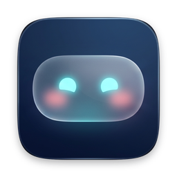

<div align="center">



# Cruno

**A tiny, always-on companion that lives in your Mac's notch — or at the top of your screen on Windows and Linux — and keeps an eye on your AI coding agents.**

Cruno, the little squircle that lives in your screen's edge, shows you what your agents are doing, lets you approve permissions, answer questions, chat with a model, drop files and check your services — all without leaving what you're doing.

[](https://github.com/YashHedaoo/cruno)
[](https://github.com/YashHedaoo/cruno)
[](https://github.com/YashHedaoo/cruno)
[](https://github.com/YashHedaoo/cruno)
[](https://github.com/YashHedaoo/cruno)
[](LICENSE)

</div>

---

## What it does

- **Agents, live in your notch** — Claude Code, Cursor, Codex, Gemini CLI, Antigravity, Copilot CLI, Muse Code, OpenCode, Amp, Hermes and more. See each session's steps, diffs and answers, and give any agent its own pill by tagging its hook payload with `crono_agent` (see [`docs/AGENTS.md`](docs/AGENTS.md)).
- **Approve and answer from the notch** — permission requests show **Allow / Deny / Always**; `AskUserQuestion` prompts show their choices right in the island.
- **Live diffs** — every file edit shows `+N −M` in the ticker; tap to read the full diff.
- **Chat** — talk to Claude, Gemini, OpenAI, or a local model (Ollama / LM Studio) directly from the island.
- **Drop a file** — Cruno swallows it, then ask a question about it or send it by email.
- **Integrations** — Stripe, n8n, GitHub, Vercel, Resend, Notion, Cal.com, each with its own colored pill.
- **Cruno on the desktop** *(macOS)* — drag him out of the island to float over your desktop; drag him onto any window to attach it as context for Claude.
- **A real character** — idle breathing, blinks, eyes that follow your cursor, emotes, 28 handcrafted sounds.
- **Private by design** — no telemetry, no account. Keys live in your macOS Keychain, Windows Credential Manager or Linux Secret Service.

## Requirements & running from source

### macOS

**Requirements**

| Tool | Version | Install |
|---|---|---|
| macOS | 15+ | — |
| Xcode | 16+ (Swift 6) | App Store / [Xcode releases](https://developer.apple.com/download/) |
| XcodeGen | latest | `brew install xcodegen` |
| Git | latest | `brew install git` |

**Run**

```bash
brew install xcodegen
git clone https://github.com/YashHedaoo/cruno.git
cd cruno/NotchBuddy
xcodegen                 # generates NotchBuddy.xcodeproj from project.yml
open NotchBuddy.xcodeproj   # then press ⌘R to build & run
```

Or from the command line:

```bash
xcodebuild -project NotchBuddy.xcodeproj -scheme NotchBuddy -configuration Debug build
```

The app launches as a floating island in your screen's notch (or a bar at the top
of the screen on displays without one).

### Windows

**Requirements**

| Tool | Version | Install |
|---|---|---|
| Windows | 10 / 11 | — |
| Rust toolchain | latest stable | https://rustup.rs |
| Node.js | 20+ | https://nodejs.org |
| MSVC Build Tools | latest ("Desktop development with C++") | https://visualstudio.microsoft.com/downloads/ |
| Git | latest | https://git-scm.com |

WebView2 ships with Windows 10/11 — nothing to install.

**Run**

```powershell
git clone https://github.com/YashHedaoo/cruno.git
cd cruno/windows
npm install
npm run tauri dev        # live-reloading development build
npm run pack             # installer lands in windows/release/
```

`npm run dev` alone serves the front end in an ordinary browser — enough to work
on the island's looks. The finished app runs from `target/release/crono.exe` and
sits in the system tray.

### Linux

**Requirements**

| Tool | Version | Install |
|---|---|---|
| Linux (x86_64) | any modern distro | — |
| Rust toolchain | latest stable | https://rustup.rs |
| Node.js | 20+ | https://nodejs.org |
| WebKitGTK, gtk-layer-shell, appindicator dev packages | distro | see below |
| Git | latest | `sudo apt install git` |

**Run** (Debian / Ubuntu)

```bash
sudo apt install build-essential pkg-config \
  libwebkit2gtk-4.1-dev libgtk-layer-shell-dev libayatana-appindicator3-dev \
  librsvg2-dev libssl-dev libdbus-1-dev patchelf \
  gstreamer1.0-plugins-base gstreamer1.0-plugins-good
git clone https://github.com/YashHedaoo/cruno.git
cd cruno/windows
npm install
npm run tauri dev         # development build
npm run pack              # AppImage, .deb and .rpm land in windows/release/
```

The island sits on the top edge on compositors with layer-shell — COSMIC, KDE
Plasma, Hyprland, Sway and other wlroots compositors. GNOME has no layer-shell,
so there it runs through XWayland as a dock window at the top of the screen. See
[`windows/README.md`](windows/README.md#linux).

## Setup

Click the Cruno icon in the menu bar (macOS) or in the system tray (Windows, Linux) → **Settings…**

| What | Why | Where the key goes |
|---|---|---|
| **Claude Code hooks** | live sessions and approvals | **Install hooks** — Cruno backs up `~/.claude/settings.json`, merges its hooks and shows you the diff before writing anything |
| **Claude plan** *(macOS, GitHub build)* | Plan usage gauge in the notch header | **Install relay** in Settings → Agents → Plan usage, then enable "Show in the notch" |
| **Gemini CLI hooks** *(macOS)* | Gemini CLI sessions in the island | **Install hooks** in Settings → Gemini CLI — backs up `~/.gemini/settings.json` |
| **Antigravity (agy) hooks** *(macOS)* | agy sessions in the island | **Install hooks** in Settings → Antigravity — backs up `~/.gemini/config/hooks.json` |
| **Anthropic API key** | chat and questions about files | Settings → Anthropic API · Keychain / Windows Credential Manager / Secret Service |
| **Google AI API key** *(macOS)* | chat with Google AI (Gemini) | Settings → Chat — other providers · Keychain |
| **OpenAI API key** *(macOS)* | chat with OpenAI | Settings → Chat — other providers · Keychain |
| **Ollama server** *(macOS)* | chat with local models via Ollama | Settings → Chat → Local models → **Connect** |
| **LM Studio server** *(macOS)* | chat with local models via LM Studio | Settings → Chat → Local models → **Connect** |
| **Active pills** *(macOS)* | choose which tools and agents appear in the island | Settings → Active pills |
| Stripe, n8n, GitHub, Vercel, Resend, Notion, Cal.com | the service pills | Keychain / Windows Credential Manager / Secret Service, all optional |

If Cruno isn't running, the hook exits immediately: **Claude Code is never blocked.**

### Supported agents

| Agent | How it connects | Mac-only? |
|---|---|---|
| Claude Code | Settings → Claude Code → **Install hooks** | No |
| Gemini CLI | Settings → Gemini CLI → **Install hooks** | Mac only |
| Antigravity | Settings → Antigravity → **Install hooks** | Mac only |
| Cursor | Hooks installed automatically alongside Claude Code | No |
| Codex | `--agent codex` flag; Settings → Codex → **Install hooks** | No |
| Copilot CLI | `--agent copilot` flag + camelCase events | No |
| Muse Code | `--agent muse` flag | No |
| OpenCode | Plugin — **Settings → OpenCode Plugin → Install** | Mac only |
| Amp | Plugin — **Settings → Amp Plugin → Install** | Mac only |
| Hermes | Plugin — **Settings → Agents → Hermes → Install** | Mac only |
| Any other | `--agent <name>` flag; see [`docs/AGENTS.md`](docs/AGENTS.md) | No |

## How it works

**macOS**

- **Island**: a borderless `NSPanel` hugging the notch, driven by a small state machine (`hidden → petit → home`).
- **Character**: drawn in SwiftUI `Canvas` + `TimelineView` at 60 fps — squircle body, eyes projected on a sphere, spring animations. No Rive, no Lottie, no images.
- **Claude Code**: a tiny `nb-hook` script receives hook events and forwards them over a Unix socket to the app. For approvals it waits for your click, then answers the hook.
- **Integrations**: lightweight pollers, paused when nothing is watching.
- **Declared pills**: `PillCatalog.swift` is the single source of truth — every pill (coding tools, agents, AI providers, services) is declared there with its ID, color and category.
- **Sounds**: 28 short WAVs played through preloaded `AVAudioPlayer`s.

The macOS app is native Swift 6 / SwiftUI / AppKit with **zero third-party dependencies**.

**Windows**

- A [Tauri 2](https://tauri.app) app (Rust + TypeScript): the island is a transparent, always-on-top window that never steals focus, Mochi is drawn in Canvas 2D with the same shapes, timings and sounds as on the Mac.
- Claude Code hooks go through a tiny `crono-hook.exe` and a named pipe; keys live in Windows Credential Manager.
- Details and differences in [`windows/README.md`](windows/README.md).

**Linux**

- The same Tauri app as Windows. On Wayland the island is a gtk-layer-shell
  overlay anchored to the top edge, and click-through is its input region.
- Claude Code hooks go through the same `crono-hook`, over a Unix socket in
  `$XDG_RUNTIME_DIR`; keys live in the Secret Service.

## Contributing

Issues and PRs are very welcome — new integrations, new emotes, new sounds, bug fixes. See [CONTRIBUTING.md](CONTRIBUTING.md).

Want to add or improve a translation? Open a PR with changes to `NotchBuddy/Resources/Localizable.xcstrings`.

## Credits

Built by [Yash Hedaoo](https://github.com/YashHedaoo) with Claude Code.
Inspired by the notch-companion concepts shared by design studios — this project is independent and not affiliated with any of them.

## License

- **Code:** [MIT](LICENSE) — use it, fork it, learn from it, just keep the copyright notice.
- **Name, Mochi character, icon, sounds and media:** © Yash Hedaoo, all rights reserved — see [LICENSE-ASSETS.md](LICENSE-ASSETS.md). Shipping your own fork? Give it your own name and character.

---

[GitHub](https://github.com/YashHedaoo/cruno) · [Privacy](docs/privacy.html) · [Terms](docs/terms.html) · [Support](docs/support.html)